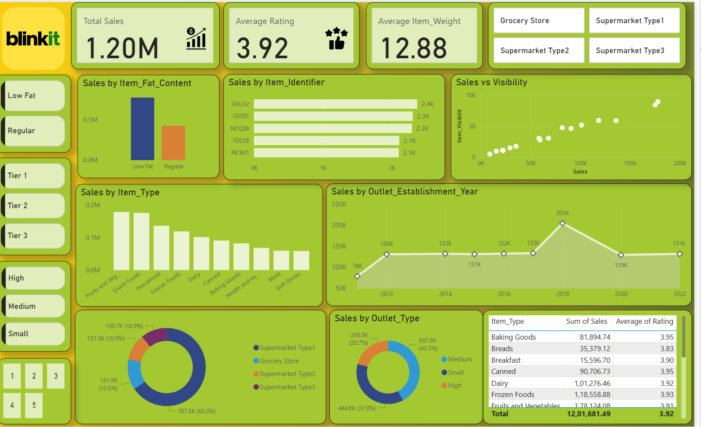

# BlinkIT Grocery Sales Analysis Dashboard

## 📌 Project Overview
This project focuses on analyzing the **BlinkIT Grocery Sales dataset** using **SQL**, **Power BI**, and **Python** to extract insights, visualize trends, and enhance decision-making for business growth.

Key highlights:
- Built an **interactive Power BI dashboard**.
- Performed **data cleaning & transformation** using Python and SQL.
- Analyzed sales patterns, customer preferences, ratings, and outlet performance.
- Delivered actionable insights for business strategy.

---

## 📂 Dataset Details
- **Dataset Name:** BlinkIT Grocery Data
- **Rows:** 8,523
- **Columns:** 12
- **Key Features:**
    - Item details (type, weight, fat content, visibility)
    - Outlet attributes (location, size, establishment year, type)
    - Sales performance metrics
    - Customer ratings

---

## 🛠️ Tools & Technologies Used
| Tool / Technology | Purpose |
|--------------------|---------|
| **SQL (PostgreSQL / MySQL)** | Data cleaning, transformation, aggregation |
| **Python (Pandas, Matplotlib, Seaborn)** | Exploratory Data Analysis |
| **Power BI** | Interactive dashboards & KPIs |
| **Jupyter Notebook** | Data exploration & insights |
| **CSV Dataset** | Raw data source |

---

## 🔄 Project Workflow

### **Step 1: Data Preparation (SQL)**
- Imported the dataset into a SQL database.
- Cleaned inconsistent values (e.g., fat content standardization).
- Performed aggregations and derived metrics like:
    - Total Sales & Avg Sales
    - Outlet-wise performance
    - Rating distribution
    - Sales percentage by size & type

**Example SQL Queries:**
```sql
-- Total Sales in Millions
SELECT CAST(SUM(sales)/1000000 AS DECIMAL(10,2)) AS total_sales_in_millions
FROM blinkit_data;

-- Total Sales by Item Type
SELECT item_type, SUM(sales) AS total_sales
FROM blinkit_data
GROUP BY item_type
ORDER BY total_sales DESC;
```

---

### **Step 2: Exploratory Data Analysis (Python)**
- Used **Pandas** for data cleaning & transformation.
- Performed **EDA** to find:
    - Correlation between **Item Weight** and **Sales**
    - Ratings vs. Sales patterns
    - Outlet establishment trends
- Plotted insights using **Matplotlib & Seaborn**.

---

### **Step 3: Power BI Dashboard Development**
Built an **interactive BlinkIT dashboard** showing:
- **KPIs:** Total Sales, Avg Rating, Avg Weight
- **Visuals:**
    - Sales by Item Type & Fat Content
    - Outlet performance trends
    - Outlet-wise sales contribution
    - Item visibility vs. sales correlation
- Added multiple **slicers** for:
    - Item Type, Outlet Type, Tier, Size, Year

---

## 📊 Dashboard Snapshot


---

## 🔍 Key Insights
- **Supermarket Type-1** generates the **highest sales** (~65%).
- **Frozen Foods** & **Fruits/Vegetables** dominate total sales.
- **Tier-3 outlets** perform better than Tier-1 & Tier-2.
- Low-fat products contribute more to overall revenue.
- Item visibility strongly impacts sales performance.

---

## 🚀 How to Use This Project

### **1. Clone the Repository**
```bash
git clone https://github.com/pritam9952/BlinkIT-Sales-Analysis.git
```

### **2. Open the Power BI Dashboard**
```
dashboard.pbix
```

### **3. Run the SQL Queries**
```
project_query_code.sql
```

### **4. Execute the EDA Notebook**
```
Untitled.ipynb
```

---

## 📦 Deliverables
| Deliverable            | File Name                  |
|----------------------|----------------------------|
| **Power BI Dashboard** | `dashboard.pbix` |
| **SQL Code**          | `project_query_code.sql` |
| **EDA Notebook**      | `Untitled.ipynb` |
| **Dataset**          | `BlinkIT Grocery Data.csv` |
| **Dashboard Snapshot** | `dashboard.png` |

---

## 🔮 Future Improvements
- Add **predictive analytics** using ML models.
- Implement **advanced DAX measures** in Power BI.
- Build an **automated ETL pipeline** for real-time updates.

---

## 👨‍💻 Author
**Pritam Nagar**  
📧 Email: pritamnagar2211@gmail.com  
💼 LinkedIn: [https://linkedin.com/in/pritamnagar](https://linkedin.com/in/pritamnagar)  
📂 Portfolio: [https://github.com/pritam9952](https://pritam9952.github.io)
