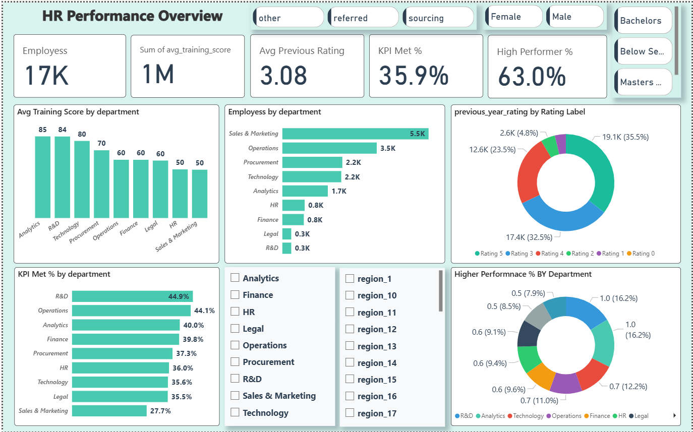
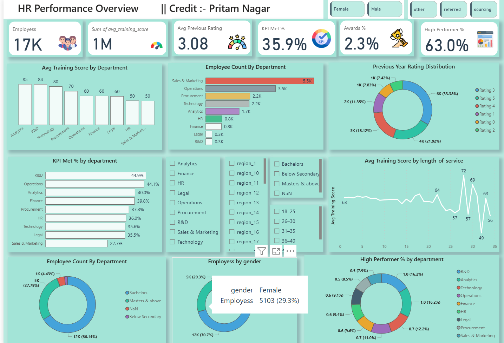

# 📊 HR Performance Dashboard – Power BI



> **Author:** Pritam Nagar  
> **Tool Used:** Power BI  
> **Dataset:** HR Employee Performance Dataset  
> **Objective:** To analyze employee performance, training effectiveness, KPIs, and workforce productivity using interactive dashboards.

---

## 📽️ Project Demo  

[](https://youtu.be/fwskFWDihsE)

**


---

## 📝 Project Overview  
This project focuses on analyzing **employee performance** using **Power BI** dashboards.  
The dashboard provides a **360° view** of workforce metrics like employee demographics, KPI achievements, training effectiveness, and previous year ratings.

It enables **HR managers** and **decision-makers** to make **data-driven decisions** by visualizing insights such as:  
- KPI performance across departments  
- Training score patterns  
- High performer percentage  
- Gender & education distribution  
- Awards & recognition statistics  

---

## 📂 Dataset Information  

| **Column**               | **Description**                                    |
|------------------------|--------------------------------------------------|
| employee_id           | Unique ID for each employee                     |
| department           | Department name                                  |
| region             | Location/region of the employee                 |
| education         | Education qualification                           |
| gender          | Gender (Male / Female)                            |
| recruitment_channel | Hiring source                                  |
| no_of_trainings  | Number of trainings attended                     |
| age            | Employee's age                                    |
| previous_year_rating | Last year's performance rating (0-5)         |
| length_of_service | Years worked in the company                   |
| KPIs_met_more_than_80 | KPI achievement (1=Yes, 0=No)              |
| awards_won     | Award received (1=Yes, 0=No)                      |
| avg_training_score | Average training score (0-100)                |

**Total Records:** 17,417  
**Total Columns:** 13  

---

## 📈 Key Metrics & KPIs  

| **Metric**             | **Value** |
|-----------------------|-----------|
| **Total Employees**   | 17K+      |
| **Sum of Training Scores** | 1M+ |
| **Average Previous Rating** | 3.08 |
| **KPI Met %**        | 35.9%     |
| **High Performer %** | 63%      |
| **Awards Won**      | 2.3%     |

---

## 📊 Dashboard Previews  

### 🔹 **Dashboard 1 – HR Performance Overview**


**Key Highlights:**  
- **Analytics** & **R&D** have the **highest training scores**.  
- **R&D** leads with **44.9% KPI achievement**.  
- **Sales & Marketing** → Largest workforce but lowest KPI success.  
- **Ratings 3 & 5** dominate previous year performance.

---

### 🔹 **Dashboard 2 – Employee Insights**


**Key Highlights:**  
- Employees with **5+ years** of experience show higher training scores.  
- Gender ratio → **70.7% Male** & **29.3% Female**.  
- **66% employees** hold **Bachelor’s degrees**.  
- Awards recognition is low (**2.3%**).

---

## 🛠️ Tools & Technologies Used  

- **Power BI** → Dashboard & visualizations  
- **Excel / CSV** → Dataset preparation  
- **DAX** → KPI calculations & measures  
- **Power Query** → Data cleaning & modeling  

---

## 🚀 How to Use  

1. **Clone the repository:**
   ```bash
   git clone https://github.com/pritam9952/Employee’s Performance for HR Analytics
   ```
2. Navigate to the repository folder.  
3. Open the `.pbix` file in **Power BI Desktop**.  
4. Explore the interactive dashboards with filters.

---

## 📌 Insights & Recommendations  

- **Sales & Marketing** needs focused **training programs** to improve KPIs.  
- Increase **employee recognition programs** → awards at only **2.3%**.  
- Target employees with **low previous ratings** for skill development.  
- Promote **gender diversity** in technical roles.

---

## 🧑‍💻 Author  

**Pritam Nagar**  
📧 [Your Email]  
🔗 [LinkedIn Profile](https://www.linkedin.com/in/pritam-nagar/)  
📌 [GitHub](https://github.com/pritam9952)
🤗 [YouTube](https://youtu.be/fwskFWDihsE)

---

## ⭐ Show Your Support  

If you find this project helpful, **please star ⭐ the repository** and share it with others!  

