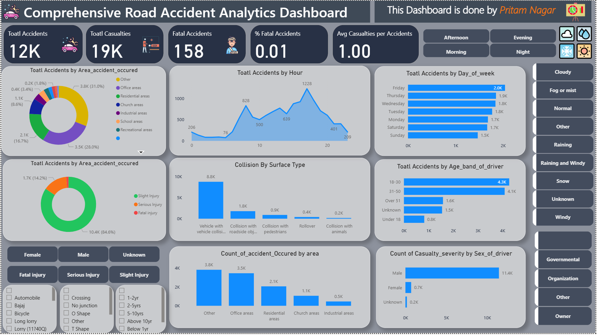

# 🚦 Comprehensive Road Accident Analytics Dashboard

An interactive and visually engaging **Power BI dashboard** designed to analyze road accident patterns across different areas, times, age groups, and conditions.  
This project provides deep insights into accidents, casualties, fatalities, and environmental impacts to assist in data-driven decision-making for safety improvements.

---

## 📌 Project Overview

Road accidents are one of the leading causes of injuries and fatalities worldwide.  
This dashboard consolidates accident data and delivers real-time insights through intuitive KPIs, charts, and slicers.  

**Goal:** Identify patterns, predict risks, and minimize casualties using data-driven analysis.

---

## ✨ Key Features

- ✅ **Total Accident Analysis** → Track total accidents, casualties, and fatalities  
- ✅ **Hourly & Daily Trends** → Discover peak accident times  
- ✅ **Area-Wise Distribution** → Residential, school, office & recreational areas  
- ✅ **Age-Based Insights** → Analyze driver age groups causing accidents  
- ✅ **Surface Type Collisions** → Breakdown of accident causes  
- ✅ **Dynamic Filters** → Filter by gender, injury type, weather, vehicle & location  
- ✅ **Interactive Slicers** → Choose time, area, and severity for detailed insights  
- ✅ **Eye-Catching UI** → Premium dark + blue theme for better readability  

---

## 🛠 Tech Stack

| Tool / Technology | Purpose |
|------------------|---------|
| **Power BI**      | Dashboard design, data modeling, DAX measures |
| **Excel / CSV**   | Dataset preprocessing and cleaning |
| **DAX**           | KPIs & calculated metrics |
| **Icons & Graphics** | Custom visuals for better storytelling |

---

## 📊 Key Insights

- 🚗 **12K+ Total Accidents** recorded  
- 🩸 **19K+ Total Casualties**  
- ☠️ **158 Fatal Accidents** with **1% fatality rate**  
- ⏰ Most accidents occur **between 4 PM and 8 PM**  
- 👨‍🦰 **Age group 18–30** has the highest accident involvement  
- 🌧️ Weather plays a significant role in accident severity  

---

## 📂 Project Structure

Road_Accident_Dashboard/
│── Dataset/
│── Dashboard.pbix # Power BI file
│── dashboard.png # Dashboard image
│── README.md # Project documentation

---

## 🚀 How to Use

1. Download the project files from this repository.  
2. Open the `.pbix` file in **Power BI Desktop**.  
3. Explore interactive charts, KPIs, slicers, and filters.  
4. Gain accident insights instantly!

---

## 📸 Dashboard Preview

---

## 🧑‍💻 Author

**Pritam Nagar**  
📧 Email: pritamnagar2211@gmail.com  
🔗 [LinkedIn](https://www.linkedin.com/in/pritam-nagar)  
🐙 [GitHub](https://github.com/Pritam9952)  

---

## ⭐ Support

If you like this project, give it a ⭐ on GitHub and share it with others!  
Your support motivates me to build more insightful dashboards.

---

## 🔮 Future Enhancements

- Integrating real-time data sources  
- Predictive analytics for accident hotspots  
- Interactive drill-through reports
