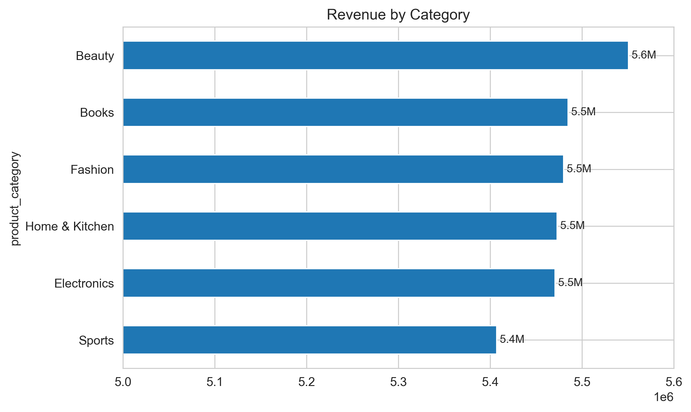
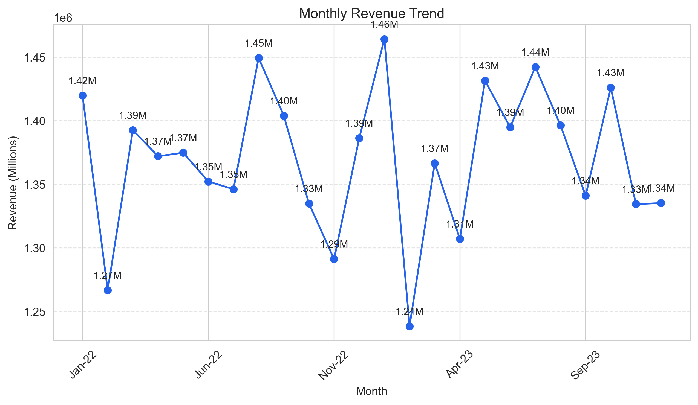
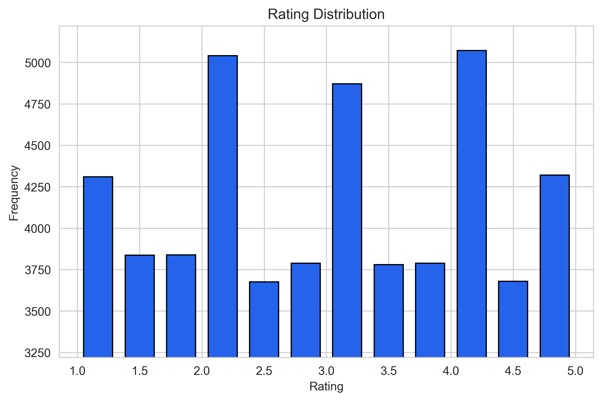
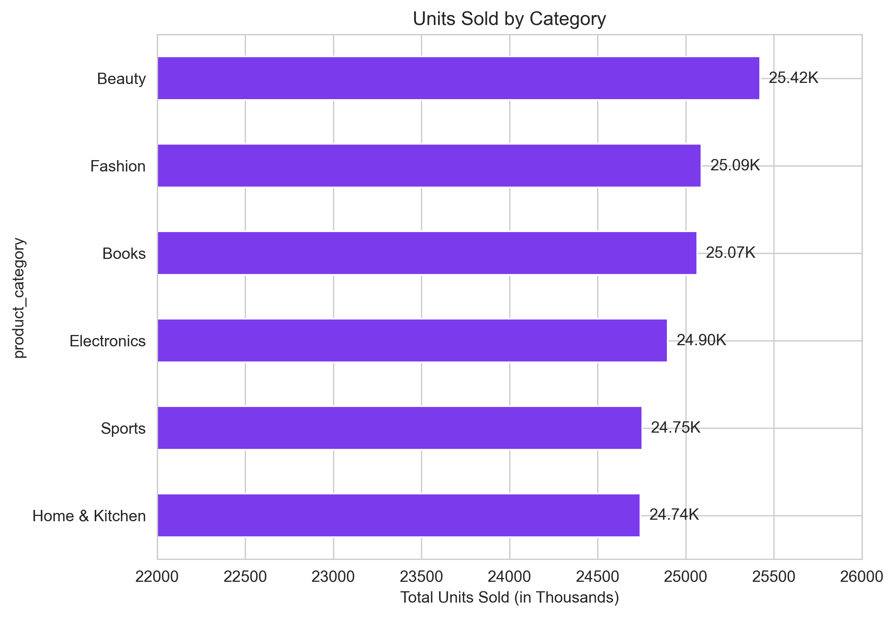
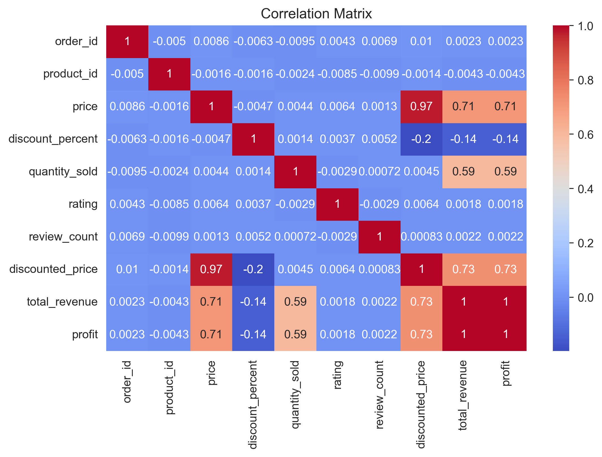
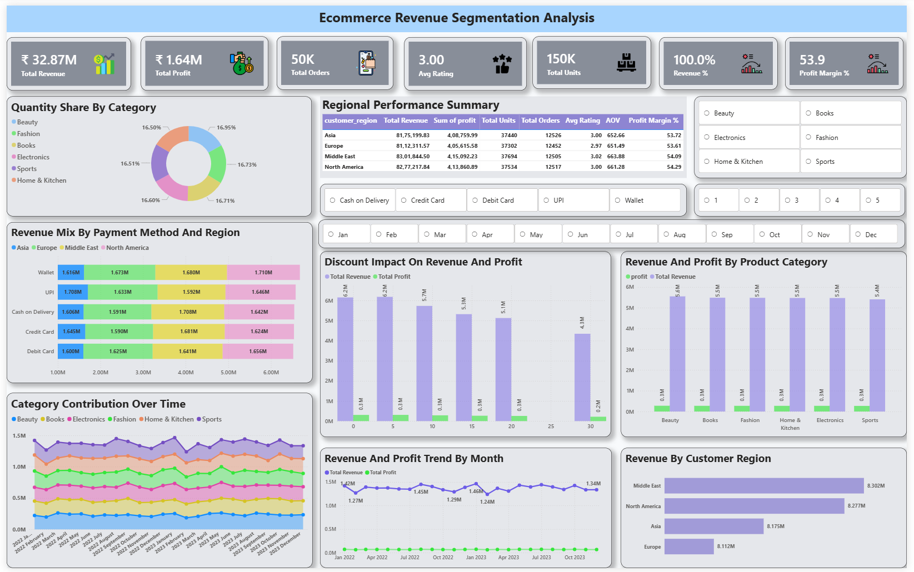

# 🛒 Ecommerce Revenue Segmentation Analysis

🚀 End-to-end Data Analytics & Business Intelligence project analyzing ecommerce sales data to identify revenue drivers, customer behavior, and optimization strategies.

---

## 🎯 Project Objective

* Analyze ecommerce transaction data
* Identify key revenue drivers
* Segment customers based on behavior
* Evaluate discount, rating, and regional impact
* Build interactive dashboard for decision-making

---

## 🛠 Tech Stack

* **SQL (PostgreSQL)** – Data cleaning & analysis
* **Python (Pandas, Matplotlib, Seaborn)** – EDA & visualization
* **Power BI** – Interactive dashboard
* **Excel** – Validation

---

## 📂 Project Structure

```
ecommerce_revenue_segmentation_analysis/

│── data/
│   ├── raw/
│   ├── processed/
│   └── data_dictionary.md
│
│── sql/
│   ├── 01_data_cleaning.sql
│   ├── 02_kpi_analysis.sql
│   ├── 03_customer_segmentation.sql
│   └── 04_revenue_analysis.sql
│
│── python/
│   ├── eda.ipynb
│   ├── segmentation.ipynb
│   └── visuals.py
│
│── dashboard/
│   └── ecommerce_dashboard.pbix
│
│── images/
│   ├── dashboard.png
│   ├── category_revenue.png
│   ├── monthly_revenue.png
│   ├── discount_vs_revenue.png
│   ├── rating_distribution.png
│   ├── units_by_category.png
│   └── correlation_matrix.png
│
│── docs/
│   ├── insights.md
│   ├── recommendations.md
│   └── project_summary.md
│
│── README.md
```

---

# 🔍 Key Analysis

## 1️⃣ Data Cleaning (SQL)

* Handled null values
* Standardized categorical columns
* Created derived columns (discounted price, revenue, profit)

---

## 2️⃣ KPI Analysis

| Metric           | Value   |
| ---------------- | ------- |
| Total Revenue    | ₹32.87M |
| Total Profit     | ₹1.64M  |
| Total Orders     | 50K     |
| Avg Rating       | 3.00    |
| Total Units Sold | 150K    |

---

## 3️⃣ Customer Segmentation

* Revenue-based segmentation
* Frequency segmentation
* Profit-based segmentation
* RFM Analysis

👉 Result:

* All regions classified as **VIP customers**
* High frequency + high revenue behavior

---

## 4️⃣ Revenue Analysis

* Category-wise performance
* Region-wise comparison
* Monthly trends
* Discount impact
* Payment method analysis

---

# 🧾 Sample SQL Query

```sql
SELECT 
    product_category,
    SUM(total_revenue) AS total_revenue
FROM ecommerce_data
GROUP BY product_category
ORDER BY total_revenue DESC;
```

Shows BEAUTY as highest revenue category

---

# 🐍 Python EDA Visuals

## 📊 Category Revenue



---

## 📈 Monthly Revenue Trend



---

## 💸 Discount vs Revenue


---

## ⭐ Rating Distribution



---

## 📦 Units Sold by Category



---

## 🔗 Correlation Matrix



---

# 📊 Power BI Dashboard

## 🔹 Dashboard Preview



---

## 🔹 Key Visuals

* KPI Cards (Revenue, Profit, Orders, Units)
* Revenue Trend (Monthly)
* Discount Impact Analysis
* Category Contribution Over Time
* Region-wise Revenue
* Payment Method Analysis
* Customer Segmentation Filters

---

# 📊 Key Insights

* Shows **BEAUTY** as highest revenue category
* Shows **MIDDLE EAST** as top region
* Shows **low discounts (0–5%) generate highest revenue**
* Shows **balanced revenue across categories (~16–17%)**
* Shows **no strong correlation between rating and revenue**
* Shows **consistent performance across regions**

---

# 🚀 Business Recommendations

* Focus on high-performing categories (BEAUTY)
* Optimize discount strategy (avoid high discounts)
* Improve slightly weaker regions (EUROPE)
* Leverage peak months for campaigns
* Promote digital payment methods

---

# 📊 Dashboard Features

* Interactive slicers (Category, Month, Rating, Payment Method)
* Drill-down capability
* Dual-axis trend analysis
* Clean UI with consistent color theme

---

# 🧠 Business Impact

* Identified key revenue drivers
* Highlighted customer behavior patterns
* Enabled data-driven decision making
* Provided actionable business insights

---

# 📌 Conclusion

This project demonstrates a complete end-to-end data analytics workflow from raw data to business insights using SQL, Python, and Power BI.

---

# ⭐ Connect With Me

If you like this project, give it a ⭐ and connect with me on LinkedIn!

---
