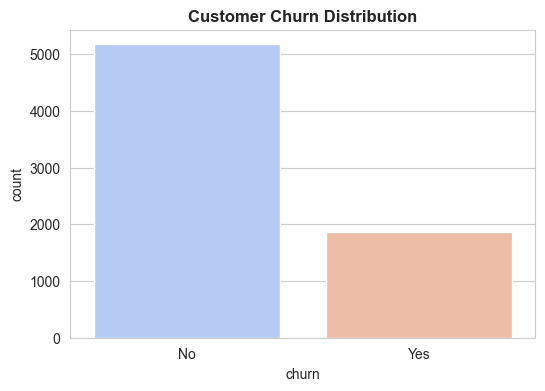
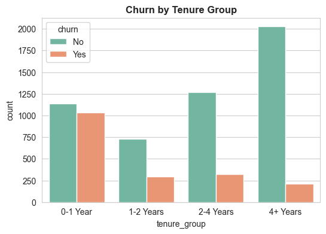
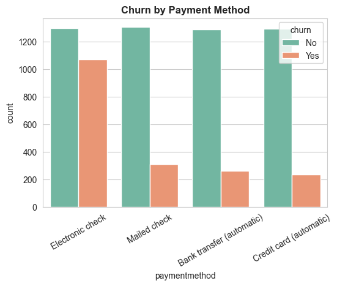
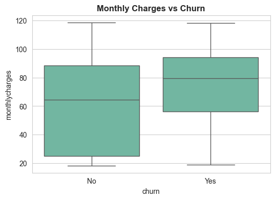
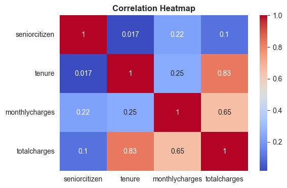
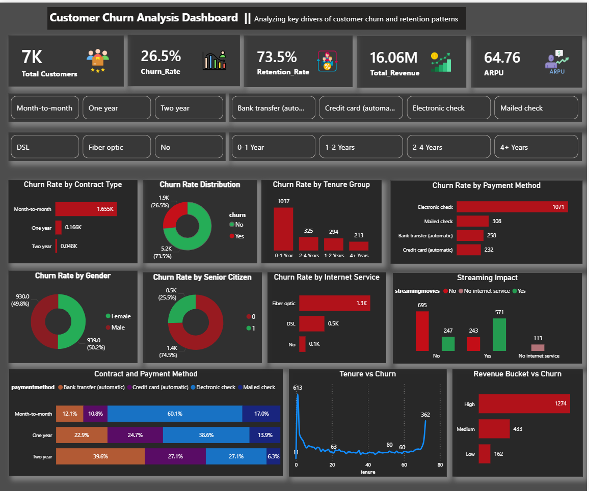

# 🎬 Netflix Customer Churn Analysis

End-to-end data analytics project focused on understanding customer churn and driving retention strategies using real-world business insights.


---

## 📌 Project Overview

This project analyzes customer churn behavior using SQL, Python, and Power BI to identify key factors influencing customer retention and provide actionable business insights.

---

## 🎯 Problem Statement

Customer churn significantly impacts revenue and growth for subscription-based businesses. This project aims to analyze customer data to understand churn patterns and recommend strategies to improve retention.

---

## 🛠️ Tech Stack

* **SQL (PostgreSQL)** – Data cleaning, KPI calculations, churn analysis
* **Python (Pandas, Matplotlib, Seaborn)** – EDA and feature engineering
* **Power BI** – Interactive dashboard and visualization

---

## 📊 Dataset

* ~7000 customer records
* Features include demographics, services, billing, and subscription details
* Target variable: **Churn (Yes/No)**

> ⚠️ Dataset not included due to size constraints. Use Telco Customer Churn dataset from Kaggle.

---

## ⚙️ Project Structure

```
netflix_user_retention_analysis/
│── data/
│── sql/
│── python/
│── dashboard/
│── docs/
│── presentation/
```

---

## 📊 Exploratory Data Analysis (EDA)

### 📉 Churn Distribution



👉 Majority customers are retained, but churn (~26.5%) is significant

---

### 📊 Churn by Contract Type


👉 Month-to-month contracts show the highest churn

---

### ⏳ Churn by Tenure Group



👉 New customers (0–1 year) are most likely to churn

---

### 💳 Churn by Payment Method



👉 Electronic check users show higher churn

---

### 💰 Monthly Charges vs Churn



👉 Higher monthly charges increase churn probability

---

### 🔥 Correlation Heatmap



👉 Strong relationship between tenure and total charges

---

## 📈 Key Insights

* Month-to-month contracts have the highest churn (~40%+)
* New customers are more likely to churn
* Electronic payment methods show higher churn
* High monthly charges increase churn probability
* Customers with multiple services are less likely to churn

---

## 🚀 Dashboard

An interactive Power BI dashboard was created to visualize:

* Churn rate and retention metrics
* Customer segmentation
* Key churn drivers

📸 Dashboard Preview:



---

## 💡 Business Recommendations

* Promote long-term subscription plans
* Improve onboarding for new customers
* Encourage automated payment methods
* Offer bundled services
* Optimize pricing strategies

---

## 🔗 Connect with Me

* GitHub: https://github.com/Pritam9952
* LinkedIn: https://www.linkedin.com/in/pritam-nagar/

---

## 💀 Conclusion

This project demonstrates how data analytics can be used to identify churn drivers and improve customer retention through data-driven decision-making.
